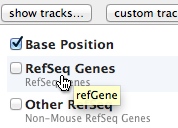

# User Guide

Welcome!  [ChromoZoom](../) aims to be the most interactive genome browser on the web for both curated and custom data, with a focus on ease of use and flexibility.

## The interface

1. Click this to show or hide standard tracks for the current genome.

2. Click this to add custom tracks from a local file or URL.

3. Type a location to jump to it, or a gene or keyword to search for matching features.
   
   For example, in the yeast genome, you can type things like:
     - `chrI:1234`
     - `chrI:1000-2000`
     - `swi1` – will find the SWI1 gene
     - `YPL016W` – the ORF name for SWI1
     - `meiosis` – find genes that have meiosis in their description

4. Zoom down to the base-pair level, or back out to the chromosome level.

5. Switch between multi-line and single-line mode.  In multi-line mode, as shown in the screenshot,
   the genome "wraps" between lines like text in a paragraph.

6. Track labels.  You can drag the track labels to change the vertical ordering of the tracks,
   and resize them to "unpack" elements as vertical space allows.

7. The "tank reticle."  Green brackets show where the current view is centered.  Zoom operations
   initiated by the zoom buttons, slider or keyboard are centered on this point.

8. The genome switcher.  Other available genomes can be accessed by clicking the up arrow.

### Mouse interactions

ChromoZoom is designed for effortless navigation by mouse.  A quick reference for the major mouse interactions can be found by clicking the "Getting started" link in the footer of the main interface.

    

- To **move**: Drag any area of the track that contains data.  To move very quickly, "throw" the track in either direction, and then grab the track again whenyou've reached your destination.
  
- To **zoom**: Use your mousewheel, or two-finger-scroll on most Macs.

- To **see individual elements**: Drag on the edges of the track labels (number 6 in the above figure)
  and the tracks will start "unpacking" elements when there is enough room.  You may have to zoom in more
  if there are too many elements to display vertically.

### Keyboard controls

- In single-line mode:
  - **→** and **←** or **A** and **D** move the display left and right.
  - **↑** and **↓** or **W** and **S** zoom in and out at the reticle position.
- In multi-line mode:
  - **→** and **←** or **A** and **D** move the display left and right.
  - **↑** and **↓** or **W** and **S** moves the display up and down by one line.
  - **Shift** plus **↑** and **↓** or **W** and **S** zooms in and out at the reticle position.
  - **Shift** plus **→** and **←** or **A** and **D** also zooms in and out at the reticle position.
  
## Tracks

Click the **show tracks...** button to add or remove standard tracks from the display at any time.

We have provided the default tracks displayed by UCSC for the human genome, and all of the tracks displayable by UCSC for the yeast genome.  Details on the data contained within each track and the drawing methods are accessible by clicking the **show tracks...** button, mousing over a track of interest and clicking the "more info..." link.  Note that these pages are provided by UCSC, and changing settings will not affect the display in **ChromoZoom**.

## Custom Tracks {#custom-tracks}

ChromoZoom is rather unique among online genome browsers in that you can display custom data from a file *on your local disk* without uploading it to a server[^1].  Using a local file is currently supported by Safari (version 6 or later), Firefox, Chrome, and Opera.  Custom data stored on a webserver can also be used by providing the URL to the file.

We currently support the [BED](http://genome.ucsc.edu/FAQ/FAQformat.html#format1), [bedGraph](http://genome.ucsc.edu/goldenPath/help/bedgraph.html), [WIG](http://genome.ucsc.edu/goldenPath/help/wiggle.html), [VCFTabix](http://genome.ucsc.edu/goldenPath/help/vcf.html), [bigBed](http://genome.ucsc.edu/goldenPath/help/bigBed.html) and [bigWig](http://genome.ucsc.edu/goldenPath/help/bigWig.html) formats, as they are specified by the UCSC genome browser. Note that they fall into two major categories:

* BED, bedGraph, and WIG are **"small"** formats and can be read straight from your disk or pasted into the browser.

* bigBed, bigWig and VCFTabix are **"big"** formats, and *require* that a file (or several files) are uploaded to a webserver you control.

Each format *must* begin with a **track line** that starts with the string `track` and specifies features and options for that track.  This line either is followed by lines of tab-delimited data for the "small" formats, or contains a `bigDataUrl` pointing to an online file for the "big" formats.  Here is a possible track line for a "small" format BED file, followed by tab-delimited data:

    track type="bed" name="Reads Group A"
    chr2 211000 215000 cloneA1
    chr2 214000 216000 cloneA2
    ...
        
A track line for a "big" format like bigBed might read like this:

    track type="bigBed" name="Track B" bigDataUrl=http://example.com/data.bb

### Examples

#### BED, WIG, bedGraph

Here are some real-world examples of the "small" formats that are known to work with ChromoZoom, downloaded from the [Saccharomyces Genome Database][sgd].  Descriptions and authors of each dataset, including PMID, are recorded as comments within the files, which can be opened in any text editor.

* BED format: [Lardenois et al. (2011)][bed-ex-1] ([view in ChromoZoom][bed-ex-1-cz])
* bedGraph format: [Buhler et al. (2007)][bedgraph-ex-1] ([view in ChromoZoom][bedgraph-ex-1-cz])
* WIG format: [Buhler et al. (2007)][wig-ex-1] ([view in ChromoZoom][wig-ex-1-cz])

[sgd]: http://downloads.yeastgenome.org/published_datasets/
[bed-ex-1]: examples/Lardenois_2011_noncoding_RNAs_V64.bed
[bed-ex-1-cz]: http://chromozoom.org/?db=sacCer3&customTracks=http://chromozoom.org/docs/examples/Lardenois_2011_noncoding_RNAs_V64.bed
[bedgraph-ex-1]: examples/Buhler_2007_rad50S_denoised_ratios_V64.bedgraph
[bedgraph-ex-1-cz]: http://chromozoom.org/?db=sacCer3&customTracks=http://chromozoom.org/docs/examples/Buhler_2007_rad50S_denoised_ratios_V64.bedgraph
[wig-ex-1]: examples/Buhler_2007_dmc1delta_denoised_ratios_V64.wig
[wig-ex-1-cz]: http://chromozoom.org/?db=sacCer3&customTracks=http://chromozoom.org/docs/examples/Buhler_2007_dmc1delta_denoised_ratios_V64.wig

[^1]: This is possible because of the magic of the [HTML5 File API](http://www.w3.org/TR/FileAPI/) and [Canvas](https://developer.mozilla.org/en/HTML/Canvas).

#### bigWig

Using a "big" format requires at least two components: the data file itself, which is binary and must be uploaded to a webserver, and the track definition file, which is plain text and contains the track line.  While requiring some extra setup, the advantage of a "big" format is that much more data can be displayed per track.  UCSC has published [an article][big-article] on the motivation for these formats and provides guidelines and tooling for creating [bigBed][bigBed] and [bigWig][bigWig] data files.

Here is a real-world example of a bigWig track that works with ChromoZoom, available from [the ENCODE project at UCSC][encode]. Our [default tracks for hg19](../?db=hg19) include an ENCODE regulation track that displays Layered H3K27Ac data (histone acetylation on H3 at residue K27), but perhaps you would like to visualize H3K4me3 data instead (methylation at H3 residue K4).  UCSC supplies [bigWig files for H3K4me3 on 7 cell lines][encode-dls] produced by the Bernstein lab at the [Broad Institute][broad].  Let's use the URL for the first one listed, a [434 MB bigWig file for GM12878][encode-gm12878] (lymphoblastoid cells).  The track definition line could be constructed to point directly to this file, like so:

    track name="H3k4me3 Gm12878" type=bigWig  bigDataUrl=http://hgdownload.cse.ucsc.edu/goldenPath/hg19/encodeDCC/wgEncodeRegMarkH3k4me3/wgEncodeBroadHistoneGm12878H3k4me3StdSig.bigWig

However, we can customize the track for better display by adding better Y-axis scaling.  We've also rehosted the file on our own server for the purposes of this example, in case it is moved by UCSC.

    track name="H3k4me3 Gm12878" type=bigWig autoScale=no viewLimits=0:50 maxHeightPixels=50:50:10 bigDataUrl=http://chromozoom.org/docs/examples/wgEncodeBroadHistoneGm12878H3k4me3StdSig.bigWig

Saving the above line into a text file and uploading it to ChromoZoom or pasting it into the Custom Tracks menu will add a visualization of ENCODE GM12878 H3k4me3 data adjacent to other tracks on hg19 ([view this in ChromoZoom][view-encode]).  You can specify multiple "big" data files by simply adding [more track lines](examples/BroadHistoneMultiH3k4me3.txt) to this file, which we've now colored according to [the schema used by UCSC's ENCODE track][ucsc-encode-track] ([view this in ChromoZoom][view-multi]).

[bigbed]: http://genome.ucsc.edu/goldenPath/help/bigBed.html
[bigwig]: http://genome.ucsc.edu/goldenPath/help/bigWig.html
[big-article]: http://bioinformatics.oxfordjournals.org/content/26/17/2204.long
[encode]: http://www.encodeproject.org/ENCODE/downloads.html
[encode-dls]: http://hgdownload.cse.ucsc.edu/goldenPath/hg19/encodeDCC/wgEncodeRegMarkH3k4me3/
[encode-gm12878]: http://hgdownload.cse.ucsc.edu/goldenPath/hg19/encodeDCC/wgEncodeRegMarkH3k4me3/wgEncodeBroadHistoneGm12878H3k4me3StdSig.bigWig
[ucsc-encode-track]: http://genome.ucsc.edu/cgi-bin/hgTrackUi?db=hg19&c=chr22&g=wgEncodeRegMarkH3k4me3
[broad]: http://www.broadinstitute.org/
[view-encode]: http://chromozoom.org/?db=hg19&customTracks=http://chromozoom.org/docs/examples/BroadHistoneGm12878H3k4me3.txt
[view-multi]: http://chromozoom.org/?db=hg19&customTracks=http://chromozoom.org/docs/examples/BroadHistoneMultiH3k4me3.txt

### Which format do I use?

- If you are plotting sequence variations, e.g. SNPs and indels, use VCFTabix.

- If you have *continuous*, *quantitative* data, e.g., floating-point values spread over base-pair positions:
  - For a relatively small amount (<100k points) of data, use WIG or bedGraph.
  - For a relatively large amount (>100k points) of data, use bigWig.

- If you have *range-based* features, e.g., selected regions of interest:
  - For a relatively small number (<10k elements), use BED.
  - For a relatively large number (>10k elements), use bigBed.

## Linking {#linking}

You may easily construct links from your webpages or web applications to ChromoZoom.  These links can open ChromoZoom in a particular genome, located at a specific position, with certain tracks that should be visible, etc.  Here is [an example link][example-link-1] that opens the yeast genome at the closest zoom level around `chrII:4000` with the SGD Genes and the Restriction Enzymes tracks expanded to their fullest height.  The URL is:

    http://chromozoom.org/?db=sacCer3&position=chrII:4000@0.1&tracks=ruler:25|sgdGene:20|cutters:250

[example-link-1]: http://chromozoom.org/?db=sacCer3&position=chrII:4000@0.1&tracks=ruler:25|sgdGene:20|cutters:250

The simplest way to generate such a link is to open ChromoZoom, move it to the desired area and add/resize tracks until you are satisfied, and then copy the link from the "links" pulldown in the navbar.  If you are using a modern browser (Chrome, Firefox, Safari, Opera) it will actually already be in your address bar.

To generate the link programmatically, the base URL is [http://chromozoom.org/](http://chromozoom.org/), and the following query parameters are available:

- `db` — **Required.** Which genome to display.  To find out the `db` name of a genome, 
  select it from the genome picker and observe the change in your browser's address bar.
  
- `position` — Which part of the genome will be displayed.  Possible formats are (examples for yeast):
  - `chrI:1000` — centers the display around chrI (the first chromosome) at base position 1000.
  - `chrI:1000-2000` — the central line will display chrI between base positions 1000-2000, with perhaps some extra room on either side depending on the closest optimal zoom level.
  - `chrI:1000@10.0` — centers the display around chrI at base position 1000, with the zoom level set to 10 base pairs per pixel.

- `tracks` — Which tracks will be shown, along with their heights.  The format is:

        <track_name>:<height_in_px>|<track_name>:<height_in_px>|...
  
  The `track_name` is the internal name of the tracks specified by ChromoZoom; to find out what it is for any particular 
  track, either inspect the URL in the "links" pulldown, or hover over it in the track picker:
  
  
  
  The top-to-bottom ordering of the tracks will match the left-to-right order of the parameter value.

- `mode` — You can force the browser to be in either `single` or `multi` mode.

- `customTracks` — URLs to custom track files that will be loaded into the browser.  *This parameter can be repeated*.  Here is [an example link][example-link-2] that loads two BED files, [hg18-1.bed][bed-1] and [hg18-2.bed][bed-2], onto the human genome and centers the display on the area of interest:

        http://chromozoom.org/?db=hg18&position=chr2:210000-225000
          &tracks=ruler:50|knownGene:150|_hg18-1-bed_Reads-Group-A:40
            |_hg18-2-bed_Reads-Group-B:40
          &customTracks=http://chromozoom.org/docs/examples/hg18-1.bed
          &customTracks=http://chromozoom.org/docs/examples/hg18-2.bed

[example-link-2]: http://chromozoom.org/?db=hg18&position=chr2:210000-225000&tracks=ruler:50|knownGene:150|_hg18-1-bed_Reads-Group-A:40|_hg18-2-bed_Reads-Group-B:40&customTracks=http://chromozoom.org/docs/examples/hg18-1.bed&customTracks=http://chromozoom.org/docs/examples/hg18-2.bed
[bed-1]: http://chromozoom.org/docs/examples/hg18-1.bed
[bed-2]: http://chromozoom.org/docs/examples/hg18-2.bed

## Source code

You can [fork this project on Github](http://github.com/rothlab/chromozoom).

### License

ChromoZoom is free for academic, nonprofit, and personal use.  The source code is licensed under the [GNU Affero General Public License v3](http://www.gnu.org/licenses/agpl-3.0.html).  In a nutshell, this license means that you are free to copy, redistribute, and modify the source code, but you are expected to provide the source for any code derived from ChromoZoom to anybody that receives the modified code or uses it over a computer network (e.g. as a web application).  ChromoZoom is not free for commercial use.  For commercial licensing, please contact the [Roth laboratory](http://llama.mshri.on.ca).