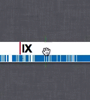
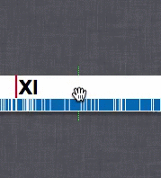
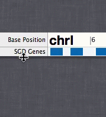

# User Guide

Welcome!  [ChromoZoom](../) aims to be the most interactive genome browser on the web for both curated and custom data, with a focus on ease of use and flexibility.

## The interface

1. Click this to show or hide standard tracks for the current genome.

2. Click this to add custom tracks from a local file or URL.

3. Type a location to jump to it, or a gene or keyword to search for matching features.
   
   For example, in the yeast genome, you can type things like:
     - `chrI:1234`
     - `chrI:1000-2000`
     - `swi1` – will find the SWI1 gene
     - `YPL016W` – the ORF name for SWI1
     - `meiosis` – find genes that have meiosis in their description

4. Zoom down to the base-pair level, or back out to the chromosome level.

5. Switch between multi-line and single-line mode.  In multi-line mode, as shown in the screenshot,
   the genome "wraps" between lines like text in a paragraph.

6. Track labels.  You can drag the track labels to change the vertical ordering of the tracks,
   and resize them to "unpack" elements as vertical space allows.

7. The "tank reticle."  Green brackets show where the current view is centered.  Zoom operations
   initiated by the zoom buttons, slider or keyboard are centered on this point.

8. The genome switcher.  Other available genomes can be accessed by clicking the up arrow.

### Mouse interactions

ChromoZoom is designed for effortless navigation by mouse.  A quick reference for the major mouse interactions can be found by clicking the "Getting started" link in the footer of the main interface.

  

- To **move**: Drag any area of the track that contains data.  To move very quickly, "throw" the track in either direction, and then grab the track again whenyou've reached your destination.
  
- To **zoom**: Use your mousewheel, or two-finger-scroll on most Macs.

- To **see individual elements**: Drag on the edges of the track labels (number 6 in the above figure)
  and the tracks will start "unpacking" elements when there is enough room.  You may have to zoom in more
  if there are too many elements to display vertically.

### Keyboard controls

- In single-line mode:
  - **→** and **←** or **A** and **D** move the display left and right.
  - **↑** and **↓** or **W** and **S** zoom in and out at the reticle position.
- In multi-line mode:
  - **→** and **←** or **A** and **D** move the display left and right.
  - **↑** and **↓** or **W** and **S** moves the display up and down by one line.
  - **Shift** plus **↑** and **↓** or **W** and **S** zooms in and out at the reticle position.
  - **Shift** plus **→** and **←** or **A** and **D** also zooms in and out at the reticle position.
  
## Tracks

Click the **show tracks...** button to add or remove standard tracks from the display at any time.

We have provided the default tracks displayed by UCSC for the human genome, and all of the tracks displayable by UCSC for the yeast genome.  Details on the data contained within each track and the drawing methods are accessible by clicking the **show tracks...** button, mousing over a track of interest and clicking the "more info..." link.  Note that these pages are provided by UCSC, and changing settings will not affect the display in **ChromoZoom**.

## Custom Tracks {#custom-tracks}

ChromoZoom is rather unique among online genome browsers in that you can display custom data from a file *on your local disk* without uploading it to a server[^1].  Using a local file is currently supported by Firefox, Chrome, and Opera; Safari 5 unfortunately does not have the correct API, but it is likely to be added in Safari 6.  Custom data stored on a webserver can also be used by providing the URL to the file.

We currently support the [BED](http://genome.ucsc.edu/FAQ/FAQformat.html#format1), [WIG](http://genome.ucsc.edu/goldenPath/help/wiggle.html), [VCFTabix](http://genome.ucsc.edu/goldenPath/help/vcf.html), [bigBed](http://genome.ucsc.edu/goldenPath/help/bigBed.html) and [bigWig](http://genome.ucsc.edu/goldenPath/help/bigWig.html) formats, as they are specified by the UCSC genome browser. 

Note that bigBed, bigWig and VCFTabix are "big" formats, and *require* that a file (or several files) are uploaded to a webserver you control.  BED and WIG are "small" formats and can be read straight from your disk or pasted into the browser.

Each format begins with a *track line* that starts with the string `track` and specifies features and options for that track.  This line either contains a `bigDataURL` pointing to an online file for the "big" formats, or is followed by lines of tab-delimited data for the "small" formats.

[^1]: This is possible because of the magic of the [HTML5 File API](http://www.w3.org/TR/FileAPI/) and [Canvas](https://developer.mozilla.org/en/HTML/Canvas).

### Picking a format

- If you are plotting sequence variations, e.g. SNPs and indels, use VCFTabix.
- If you have *continuous*, *quantitative* data, e.g., floating-point values spread over base-pair positions:
  - For a relatively small amount (<100k points) of data, use WIG.
  - For a relatively large amount (>100k points) of data, use bigWig.
- If you have *range-based* features, e.g., selected regions of interest:
  - For a relatively small number (<10k elements), use BED.
  - For a relatively large number (>10k elements), use bigBed.

## Source code

You can [fork this project on Github](http://github.com/rothlab/chromozoom).

### License

ChromoZoom is free for academic, nonprofit, and personal use.  The source code is licensed under the [GNU Affero General Public License v3](http://www.gnu.org/licenses/agpl-3.0.html).  In a nutshell, this license means that you are free to copy, redistribute, and modify the source code, but you are expected to provide the source for any code derived from ChromoZoom to anybody that receives the modified code or uses it over a computer network (e.g. as a web application).  ChromoZoom is not free for commercial use.  For commercial licensing, please contact the [Roth laboratory](http://llama.mshri.on.ca).